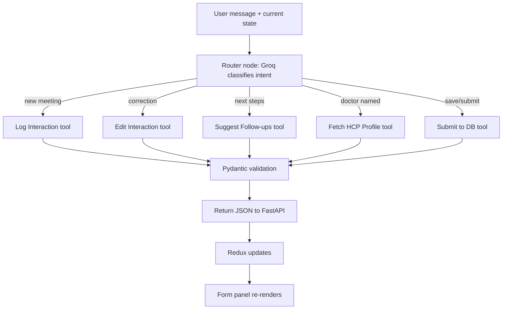
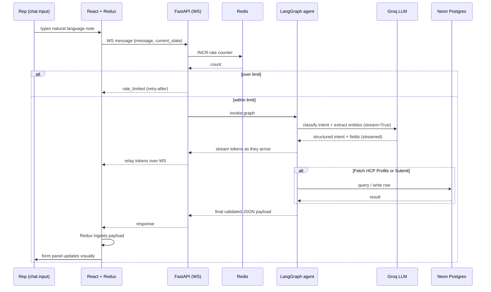

# AI-First CRM Interaction Logger — Project Plan

**Assignment scope:** AI-driven Log Interaction Screen for life science field reps.
**Core rule:** All data entry happens through natural language in the chat panel. The form is read-only and purely reflects Redux state.

---

## 1. Objectives

- Build a split-screen React app: read-only form (left) + AI chat assistant (right).
- Route every chat message through a LangGraph agent that decides which of 5 tools to call.
- Persist finalized interaction logs to Neon Postgres.
- Ship a clean, reviewable repo + a demo video that proves all 5 tools work end-to-end.

---

## 2. Tech Stack & Approach

| Layer | Choice | Notes |
|---|---|---|
| Frontend | React + Redux Toolkit | Form fields are `readOnly`, driven entirely by Redux state |
| Backend | FastAPI | WebSocket bridge: receives `{message, current_state}`, streams back updated state |
| Agent | LangGraph | Stateful graph with a router node + 5 tool nodes |
| LLM | Groq (`gemma2-9b-it`) | Entity extraction, intent routing, tool-argument generation — called over HTTP with `stream=True`, relayed to the client over the websocket |
| Cache / rate limiter | Redis | Sliding-window request counter to protect the Groq free tier; secondary use as an HCP-profile lookup cache |
| Database | Neon (serverless Postgres) | `interactions` + `hcp_profiles` tables |
| Schema validation | Pydantic | Every tool output is validated before returning to frontend |

**Why Neon specifically:** serverless Postgres means no local DB setup for whoever reviews your repo — they just need a connection string in `.env`. Worth calling out explicitly in your README and in the video, since it removes a common setup-friction point for graders.

**Why websocket instead of plain REST:** Groq itself has no websocket endpoint — its speed comes from the LPU inference hardware, not the transport. The websocket lives between React and FastAPI only. Inside the handler, FastAPI calls Groq with `stream=True` and relays each token chunk to the client over the open socket, so the chat panel (and eventually the form) can update incrementally instead of waiting for the full tool call to finish.

**Why Redis, specifically for rate limiting:** the Groq free tier is capped per-minute (requests and tokens) and resets on a rolling window. An in-memory counter in a single FastAPI process would work for a demo but resets on every server restart and won't hold up if you ever run more than one worker. Redis gives you an atomic counter (`INCR` + `EXPIRE`) that's correct regardless of process count — worth having even at this scale because it's the correct pattern, not just a bigger one.

---

## 3. High-Level Architecture

*(See the diagram rendered above in this conversation — same structure, described in text below for the repo doc.)*

```
React (Form panel | Chat panel)
        │  WS  { message, current_state }
        ▼
FastAPI backend  ──── rate-limit check ────▶  Redis (counter)
        │                                        (reject/queue if over budget)
        ▼
LangGraph agent (router node)
        │
   ┌────┼─────────────────────┐
   ▼    ▼                     ▼
Groq LLM   Neon Postgres   (5 tool nodes execute here)
(extraction,  (read/write,
 stream=True)  cached via Redis
               for HCP lookups)
        │
        ▼
Validated JSON state → FastAPI → WS relay → Redux → Form re-renders
```

---

## 4. Repository Structure (monorepo, layered backend)

A layered backend structure signals separation of concerns to a reviewer — routers don't know about LangGraph internals, services don't know about HTTP. This matters more here than raw speed, since the whole point of the assignment is judging your architecture.

```
ai-crm-interaction-logger/
├── README.md
├── docs/
│   ├── architecture.md
│   ├── agent-design.md
│   └── demo-script.md
├── .env.example
│
├── frontend/
│   ├── package.json
│   ├── public/
│   └── src/
│       ├── app/
│       │   └── store.js                # Redux store config
│       ├── features/
│       │   └── interaction/
│       │       ├── interactionSlice.js  # Redux slice: form state
│       │       └── interactionSelectors.js
│       ├── components/
│       │   ├── FormPanel/
│       │   │   ├── FormPanel.jsx
│       │   │   └── fields/              # one component per field group
│       │   └── ChatPanel/
│       │       ├── ChatPanel.jsx
│       │       ├── ChatMessage.jsx
│       │       └── ChatInput.jsx
│       ├── api/
│       │   └── chatApi.js               # POST /chat wrapper
│       ├── App.jsx
│       └── index.js
│
├── backend/
│   ├── requirements.txt
│   ├── app/
│   │   ├── main.py                      # FastAPI app entrypoint
│   │   ├── routers/
│   │   │   └── chat_ws.py               # WebSocket /ws/chat route only
│   │   ├── services/
│   │   │   ├── agent_service.py         # invokes compiled LangGraph, formats response
│   │   │   └── rate_limiter.py          # Redis-backed sliding-window limiter
│   │   ├── cache/
│   │   │   └── redis_client.py          # Redis connection + get/set helpers
│   │   ├── agents/
│   │   │   ├── graph.py                 # LangGraph graph definition + router node
│   │   │   ├── state.py                 # TypedDict / Pydantic agent state schema
│   │   │   └── tools/
│   │   │       ├── log_interaction.py
│   │   │       ├── edit_interaction.py
│   │   │       ├── suggest_followups.py
│   │   │       ├── fetch_hcp_profile.py
│   │   │       └── submit_to_db.py
│   │   ├── models/
│   │   │   ├── schemas.py               # Pydantic response schemas per tool
│   │   │   └── db_models.py             # SQLAlchemy models
│   │   ├── db/
│   │   │   ├── session.py               # Neon connection + session factory
│   │   │   └── seed.py                  # mock HCP profile seed data
│   │   └── core/
│   │       └── config.py                # env vars, Groq key, DB URL
│   └── tests/
│       └── test_tools/                  # one test file per tool
│
└── .github/
    └── workflows/
        └── ci.yml                        # optional: lint + test on push
```

**Why this layout scores well with reviewers:**
- `routers/` never imports LangGraph directly — only `services/` does. Swapping frameworks later wouldn't touch the API layer.
- One file per tool under `agents/tools/` makes the "5 required tools" trivially easy for a grader to locate and review individually.
- `models/schemas.py` holding the Pydantic contracts is the single source of truth both the agent and FastAPI return type depend on — this is what enforces "strict, predictable JSON payload" from the assignment.
- `services/rate_limiter.py` sits between the websocket router and `agent_service.py` — it's checked before the agent is invoked, not inside a tool, so every Groq call (router classification included) is covered by one gate rather than five separate checks.

---

## 5. LangGraph Agent Design

### 5.1 Agent state (shared across nodes)

Conceptually, the graph carries a state object with:
- `messages`: chat history for the current turn
- `current_form_state`: the Redux state passed in from the frontend
- `intent`: which tool the router decided to invoke
- `tool_output`: the validated payload to send back

### 5.2 Router logic

The router node is the first stop. It asks Groq to classify the incoming message against the 5 tool intents, using the current form state as context (so "actually, neutral not positive" is recognized as an edit, not a new log).

### 5.3 Tool responsibilities

| Tool | Trigger | Reads | Writes |
|---|---|---|---|
| Log Interaction | New meeting described | Chat text | Full form JSON |
| Edit Interaction | Correction phrased | Chat text + current state | Only changed fields |
| Suggest Follow-ups | Topics/outcomes present, or asked | Topics, outcomes | `suggested_followups[]` |
| Fetch HCP Profile | Doctor's name mentioned | HCP name | Chat message (context), not form |
| Submit to Database | "Save/submit" phrasing | Full current state | DB row + confirmation message |

### 5.4 Agent flow



---

## 5.5 Rate Limiting Design (Redis)

**Why here, not client-side:** the frontend can't be trusted to self-limit (a reviewer could open two tabs), so the gate has to live on the backend, in front of every Groq call — not just the router, since the free tier counts *all* requests to the model, including tool-argument generation calls if you make more than one per turn.

**Pattern:** fixed-window counter per key, stored in Redis.

- Key: `rate:groq:{minute_bucket}` (or per-connection if you want per-user fairness: `rate:groq:{session_id}:{minute_bucket}`)
- On each request: `INCR` the key, `EXPIRE` it at 60s on first increment.
- If the count exceeds your configured ceiling (set comfortably under Groq's published free-tier limit, with headroom), reject the request over the websocket with a `rate_limited` message and a short retry-after, rather than letting it hit Groq and come back with a 429.
- Groq's own SDK already retries 429s with backoff — your Redis gate is there to avoid *triggering* that in the first place, since you'd rather fail fast and tell the rep "one moment" than silently retry and stall the socket.

**Where it plugs into the flow:** `services/rate_limiter.py` is called once per incoming websocket message, before `agent_service.py` invokes the LangGraph graph. If the limiter rejects, the agent and Groq are never touched for that turn.

---

## 6. End-to-End Data Flow (per user action)



---

## 7. Database Schema (Neon Postgres)

| Table | Key columns |
|---|---|
| `interactions` | id, hcp_name, interaction_type, date, time, attendees, topics_discussed, materials_shared, samples_distributed, sentiment, outcomes, follow_up_actions, created_at |
| `hcp_profiles` | id, name, specialty, tier, last_interaction_sentiment, notes |

Approach: seed `hcp_profiles` with 5–10 mock doctors so the Fetch HCP Profile tool has something realistic to return during the demo.

---

## 8. API Contract (backend ⇄ frontend, over WebSocket)

**Client → server** (`ws://.../ws/chat`)
```json
{
  "message": "Met Dr. Smith today at 2pm, discussed Product X, he was positive",
  "current_state": { "...": "current Redux form state" }
}
```

**Server → client, streamed tokens** (while Groq is generating)
```json
{ "type": "token", "content": "..." }
```

**Server → client, final payload**
```json
{
  "type": "result",
  "tool_used": "log_interaction",
  "updated_state": { "...": "full or partial form fields" },
  "chat_reply": "Logged your meeting with Dr. Smith.",
  "suggested_followups": ["Send OncoBoost PDF", "Follow up in 2 weeks"]
}
```

**Server → client, rate limited**
```json
{ "type": "rate_limited", "retry_after_seconds": 12 }
```

Keeping the `result` message identical across all 5 tools (only `updated_state` contents differ) is what makes the Redux reducer trivial — one action type, `state = {...state, ...action.payload.updated_state}`. The `token` messages are purely cosmetic (chat panel streaming) and never touch Redux directly.

---

## 9. Suggested Build Order

1. Redux store + static form UI (no AI yet) — confirms layout matches the screenshot.
2. FastAPI skeleton + `/chat` route returning a hardcoded payload — confirms wiring.
3. LangGraph graph with Log Interaction + Edit Interaction (the 2 mandatory tools) wired to Groq.
4. Neon Postgres + Submit to Database tool.
5. Fetch HCP Profile + Suggest Follow-ups (the remaining custom tools).
6. Polish: chat history persistence, error states, loading indicators.
7. Record demo video.

---

## 10. Deliverables Checklist (mapped to assignment)

- [ ] GitHub repo, frontend + backend, structured as above
- [ ] README with setup steps, `.env.example` for Groq key, Neon connection string, and Redis URL
- [ ] All 5 tools demonstrably working via chat only (no manual form entry)
- [ ] Rate limit gate demonstrably rejecting/queuing once the configured ceiling is hit (nice to show briefly in the video)
- [ ] 10–15 min video: UI walkthrough → live tool demo → LangGraph code walkthrough → architecture summary

---

## 11. Demo Video Script Outline

1. **(1–2 min)** HLD diagram walkthrough — what talks to what and why.
2. **(1 min)** Repo/folder structure tour — explain the layering choice.
3. **(6–8 min)** Live demo: type each of the 5 trigger phrases in order (log → edit → HCP fetch → suggest follow-ups → submit), narrating what's happening in Redux/DB as it happens.
4. **(2–3 min)** Code walkthrough: router node, one tool file, the Pydantic schema.
5. **(1 min)** Closing summary: the architectural challenge and how the design solves it.

---

*Next step: pick a build order module (frontend Redux slice, FastAPI skeleton, or LangGraph graph) and we'll go into implementation detail with code.*
